```{r}
library(tidyverse)
here::here("helpers/discovr_helpers.R") |> source()
```


## Books, books, books

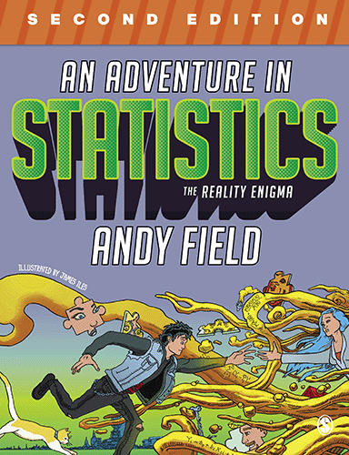{.absolute width=327.299px height=430.266px left=323.577px top=79.44px}


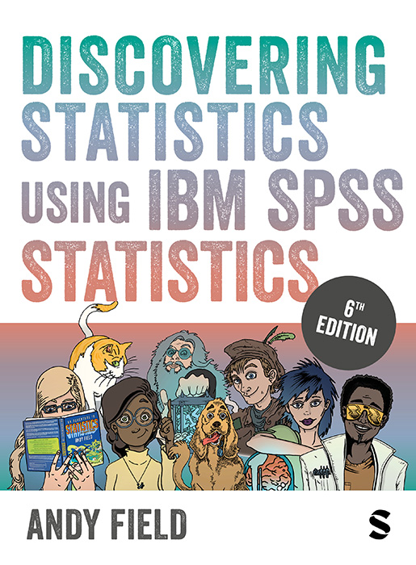{.absolute width=327.366px height=414.39px left=-5.12444px top=93.0577px}


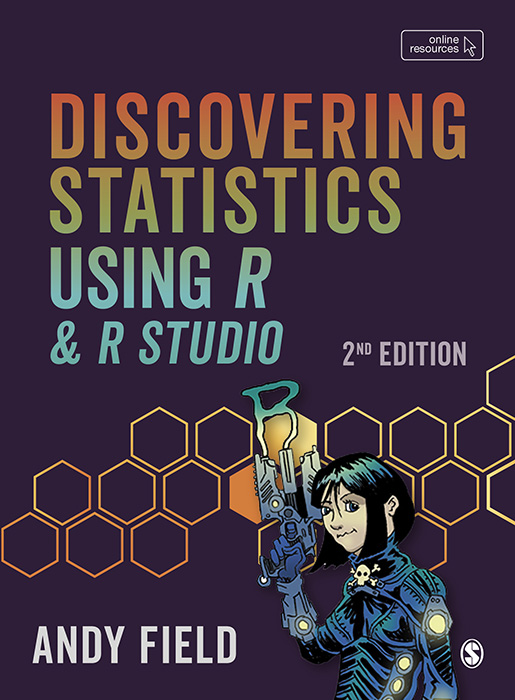{.absolute width=326.191px height=431.531px left=674.797px top=76.5023px}


## {background-video="../shared_media/video/ais_promo_small.mp4"}


## Too long, won't listen

::: {.fragment .fade-in-then-out .absolute top=100}


> *If you're not doing something different, you're not doing anything at all.*
>
> (Edward Tufte)

:::

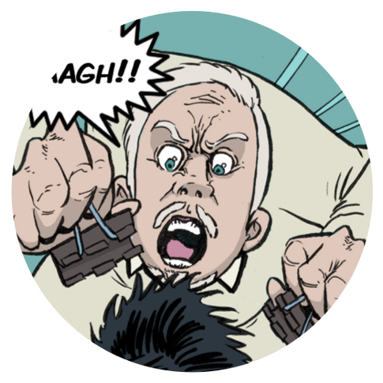{.absolute width=349.108px height=326.34px left=1.78701px top=264.426px}

{.absolute width=320.749px height=338.957px left=554.043px top=239.511px}


::: notes

Given I don't know what to say I'm going to borrow words from someone more famous, well-respected and quotable than I am: visualization guru (and sculptor) Edward Tufte (Tuff-tee). Apparently he has a small sign taped to his computer screen that says "If you're not doing something different, you're not doing anything at all." It's a note that I don't have taped to my monitor, but I probably should because I like 'different', and I strive for 'different', not always in a good way. 

:::

## The Phonecall


{.absolute width=410.771px height=432.975px left=0px top=65px}


{.absolute width=411.631px height=431.798px left=623.544px top=26.8088px}

{.absolute width=223.584px height=84.7121px left=723.158px top=460.009px}

::: fragment

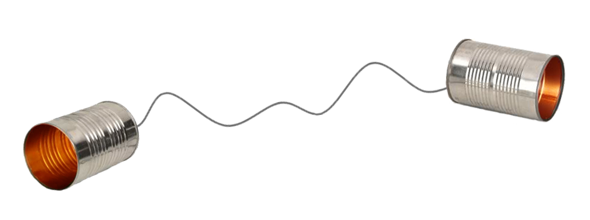{.absolute width=561.411px height=232.27px left=229.718px top=147.921px}

:::

::: notes

A couple of years later Wiley asked me to write them a 'stats for dummies' book. I was tempted. I spoke to my editor at SAGE about it, and after I assume some kind of collective SAGE London panic attack I received a phone call from Ziyad. I've known Ziyad a long time – he signed my first book – but trust me, he rarely phones me. That's true of most people because I go to great lengths to tell everyone how uncomfortable telephones make me, but a call from Ziyad is a particularly rare and beautiful thing. The gist of that conversation was that Ziyad convinced me to write an intro book for SAGE instead. 'Wileys are full of arseholes' he said …. Ok, he didn't, he said 'Why not write that book for us? We will let you do whatever you like - express yourself fully.'
"What?" I asked, "You'd give me complete control even after 'the incident'?
"Yes". He replied (after what I like to mis-remember as a dramatic pause). 
Ziyad was offering me the opportunity to set my imagination free, to go somewhere that perhaps other publishers would not let me go, to try something without needing to justify it with research, or pedagogy. An opportunity to follow my heart and not my head, but what did my heart want to do?

"If you're not doing something different, you're not doing anything at all." 

:::


## The cop out


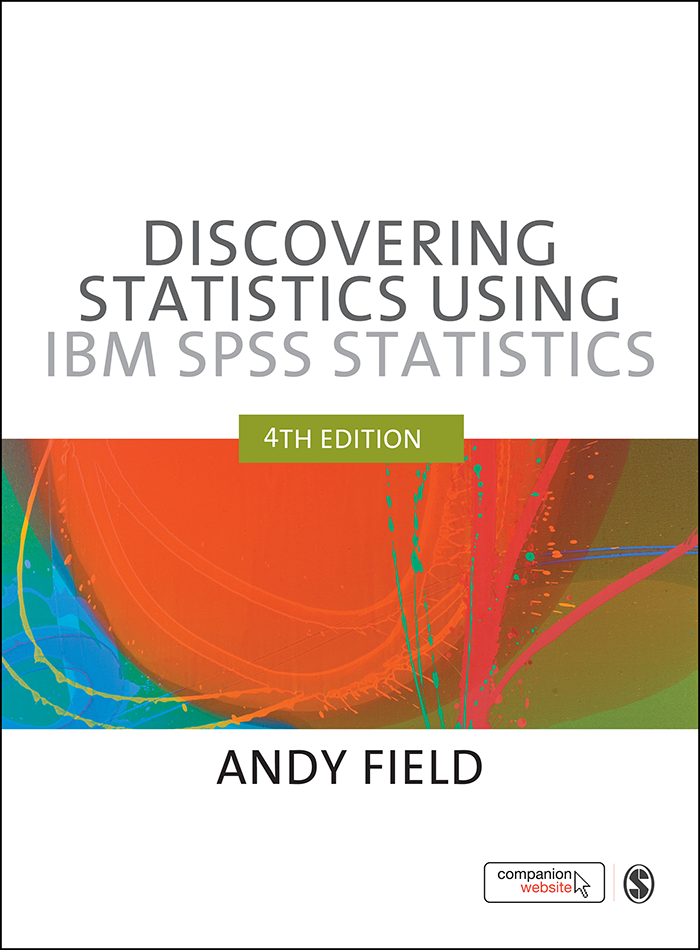{.absolute width=374.863px height=534.715px left=0px top=65px}

::: fragment

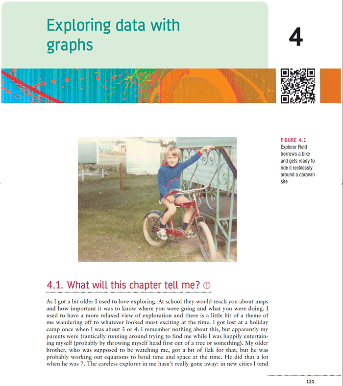{.absolute width=438.76px height=519.134px left=579.24px top=78px}

:::


::: notes

In 2008 I was in Rotterdam updating my SPSS book (third edition) and like all of my books I had a long list of dissatisfaction with the previous edition. I could just slap a new cover on the front, but I wanted to do something different. After all,
"If you're not doing something different, you're not doing anything at all."
I thought it would be interesting to try to embed the academic content within a fictional story. I didn't have a story though, and I had only 6 months to update the book. It would be impossible. So I copped out: I book-ended each chapter with an anecdote from the only story I had to hand – my life. Some thought it was different, but to me it was a poor imitation of what I could have done. 

:::


## Discovering statistics using ...


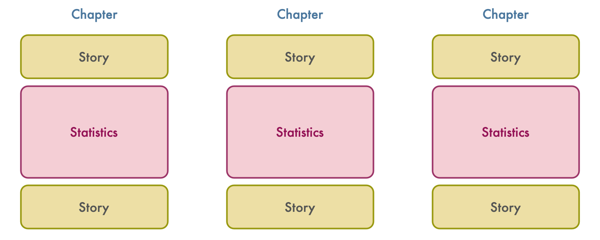{.absolute width=990.159px height=397.555px left=2.20334px top=122.287px}


## An adventure in statistics


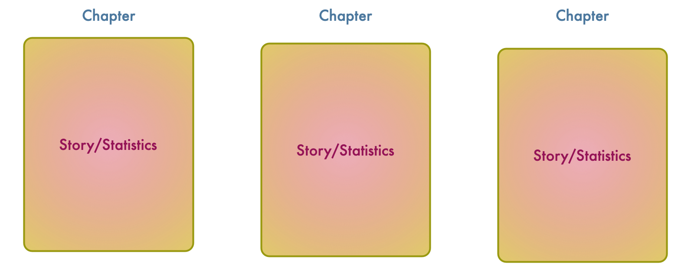{.absolute width=946.827px height=378.968px left=0.734446px top=150.196px}


::: notes

I thought back to 2008, to the idea of writing a fictional story through which a student learns statistics through a shared adventure with the main character. I thought about collaborating with a graphic novel illustrator to bring the story to life. I didn't know anything about writing fiction: but, I didn't know anything about logistic regression and multilevel models before I wrote 60-page chapters about them. Over the next two years I collected ideas for a story, an adventure in statistics. 

:::

## Bringing things to life


```{r}
#| echo: false
#| eval: true

knitr::include_url("https://www.jamesilesstudio.com/", height = "600px")
```


## The world

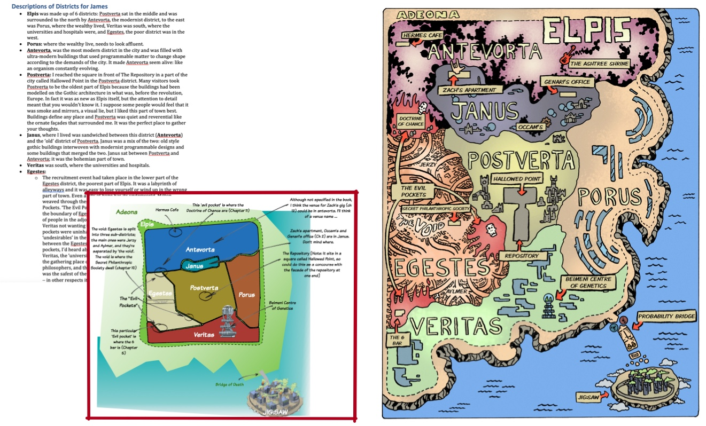{}


::: notes

I imagined a future in which the invention of the reality prism, a kind of hat that splits reality into the subjective and objective had bought society to collapse because everyone could suddenly see the truth. Without blind belief, no-one tried anymore. In the wake of this 'reality revolution' society fragmented into people who held onto the pre-technological past (the Clocktorians) and those who embraced the ever-accelerating technology of the new world (the chippers). Society had become a mix of the ultra-modern and the old fashioned.
:::

## The characters


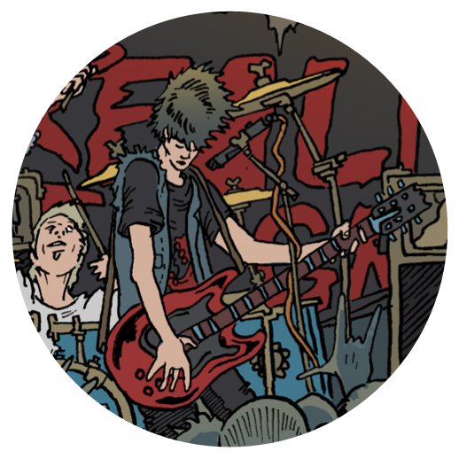{.absolute width=228px height=221px left=4px top=50px}


::: fragment

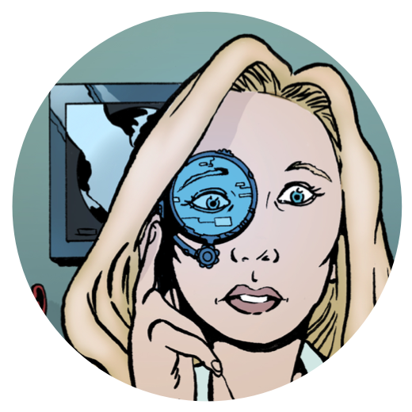{.absolute width=228px height=221px left=720px top=50px}

:::

::: fragment

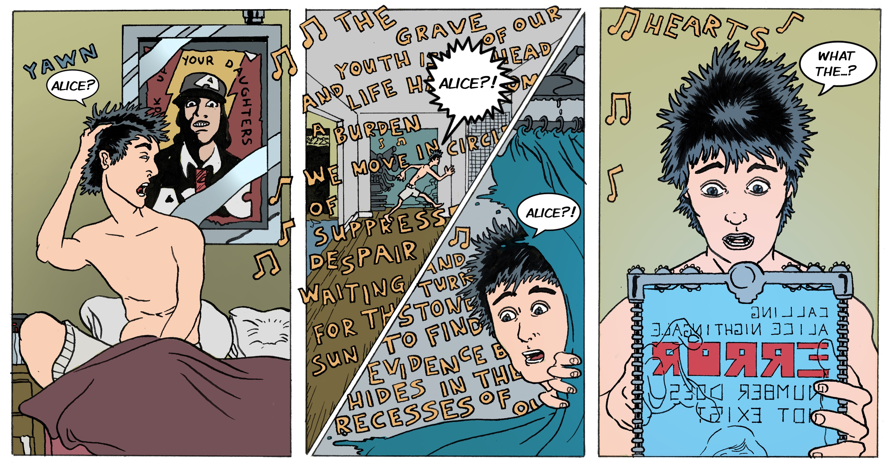{.absolute width=581.94px height=365.474px left=206.051px top=261.669px}

:::

::: fragment

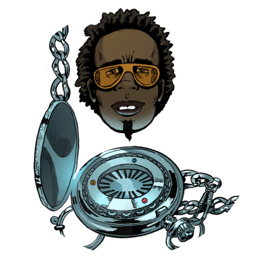{.absolute width=228px height=221px left=358px top=50px}

:::

::: notes

Into this world I put Zach, a rock musician, and his girlfriend Dr. Alice Nightingale are part of the first generation since the revolution not to be held back by the truth, to believe that they can change the world. Zach through his music, and Alice through her research. 

Then Alice suddenly disappears leaving Zach with a broken heart, a song playing on repeat and a scientific report that makes no sense to him. 

:::

## 


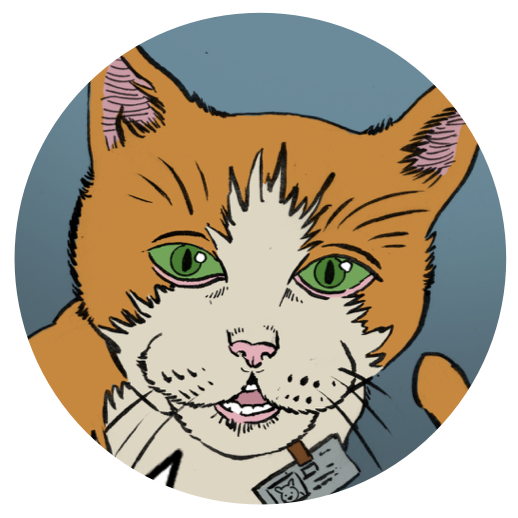{.absolute width=259px height=259px left=0px top=0px}


::: fragment

{.absolute width=259px height=260px left=570.772px top=281.17px}

:::

::: fragment

{.absolute width=260px height=259px left=762.719px top=29.9107px}

:::

::: fragment

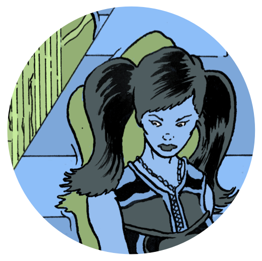{.absolute width=260px height=259px left=181.328px top=300.531px}

:::

::: fragment

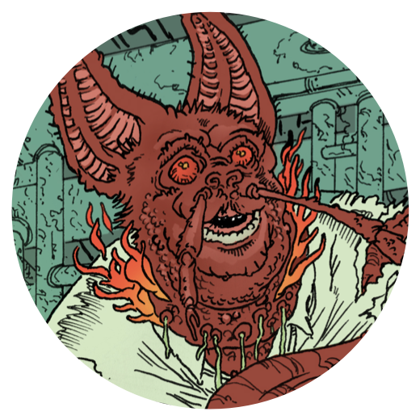{.absolute width=260px height=260px left=375.849px top=19.7678px}

:::


::: notes

Fearing the worst, he sets out to find her with only his reality checker, The Head, to help [Click].

Strange things happen: people collapse and lose their memories, he gets messages from someone called Milton, and the word JIG:SAW haunts him.

- Can he trust Milton Grey?[click]
- Why is Rob Nutcot so weird? [click]
- How is Roediger connected to Milton?
- Can he resist the advances of Celia?
- What the hell *is* Clint Vue?

Zach feels that something is terribly wrong and that Alice is in danger, but her vanishing triggers an even worse thought: that after 10 years they have drifted apart. 

At a simple level 'an adventure in statistics' is a story about Zach searching for Alice, and seeking the truth, but it's also about the unlikely friendship he develops with a sarcastic cat, it's about him facing his fear of science and numbers, it's about him learning to believe in himself. It's a story about love, about not forgetting who you are. It's about searching for the heartbeats that hide in the gaps between you and the people you love. It's about having faith in others. 
Of course, it's also about fitting models, robust methods, classical and Bayesian estimation, significance testing and whole bunch of other tedious statistical things, but hopefully you'll be so engrossed in the story that you won't notice them. Or they might be a welcome relief from the terrible fiction. Time will tell. 

:::


## Integrating story and stats

> 'What is a probability bridge?'
>
> 'It's a bridge along which there are choices to make and you need to use probability to make those choices; without understanding probability you will most likely make the wrong choice and when you do your progress is halted. It is the perfect defence.'
>
> 'Why?'
>
> 'Because absolutely no one understands probability.'
>
> Milton looked pleased with his quip. I asked him how 'progress is halted.'
>
> 'It depends upon how the tasks are configured. The best case scenario is that you have to turn around and go back.'
>
> 'And the worst?'
>
> 'You die a slow and horrifically painful death.'
>
> 'More slow and horrifically painful than learning about probability?'
>
> 'I'm afraid so... 

::: notes

Also, the examples in the book all relate to parts of the story or the 'puzzle' that Zach has to solve. The bridge of death (the probability bridge) involves several probability-based problems that Zach has to solve to cross the bridge.

:::

## Integrating story and stats

> 'The relative frequency is an empirical probability: a probability derived from actual observations, so if you understand relative frequency, you understand empirical probability. We can also look at theoretical or classical probability, which is a probability derived from probability theory.'
>
> I didn't like the sound of that. Another sound I didn't like was that of Milton scratching out a diagram on a nearby rock (Figure 7.2). 
>
> 'This diagram shows some key concepts in probability' he said excitedly, 'imagine that we looked at your Proteus and found that you had 5 friends in your contacts.'
>
> 'That's not very realistic!' I blurted.
>
> Milton looked sad, 'I'm a physics professor, in my world that is completely realistic.' 

## The bridge of death

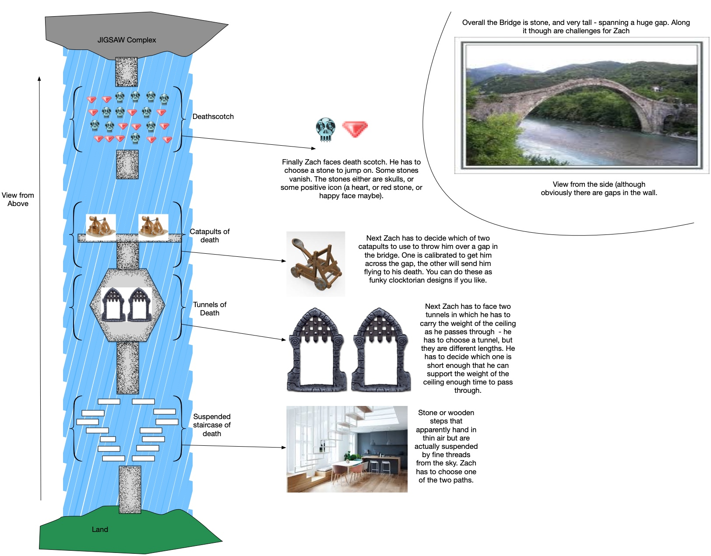{.absolute width=1088.35px height=570.489px left=7px top=56px}

## The bridge of death

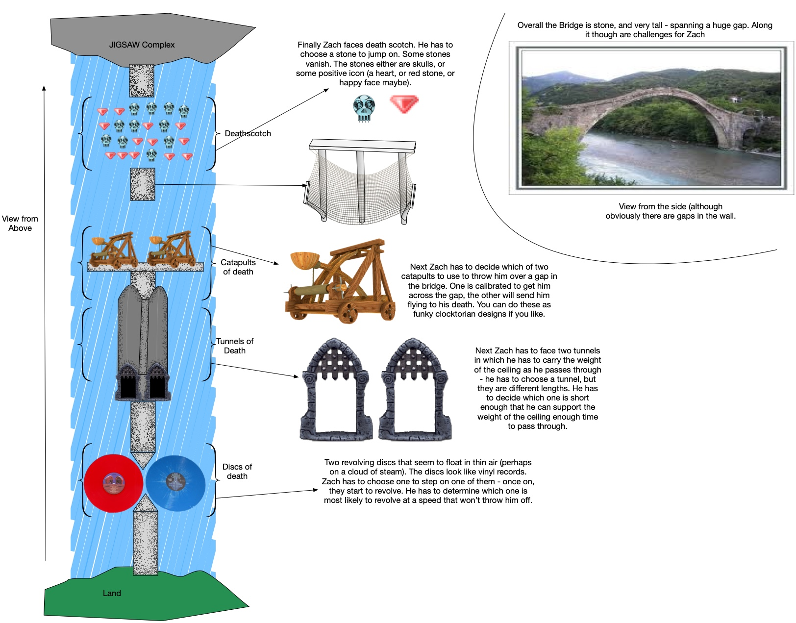{.absolute width=1088.35px height=570.489px left=7px top=56px}

## The bridge of death

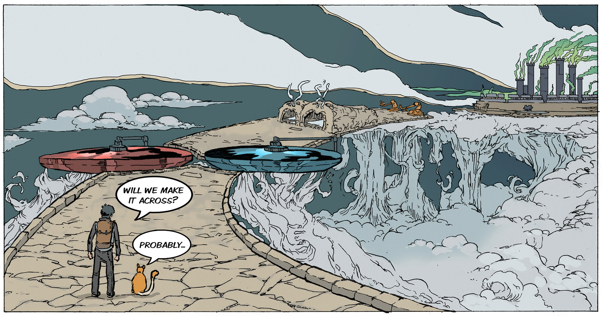{.absolute width=1088.35px height=570.489px left=7px top=56px}


## 

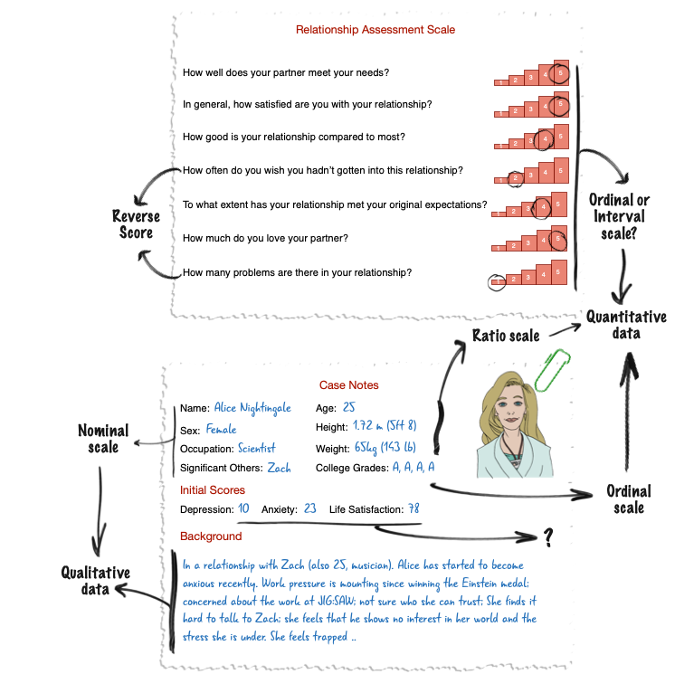{.absolute width=690.005px height=690.005px left=36.7268px top=-27.7344px}

::: notes

Another example. In this case he steals some notes about Alice from her therapist, through which he learns about different types of data and scales of measurement.

:::

## Developing characters

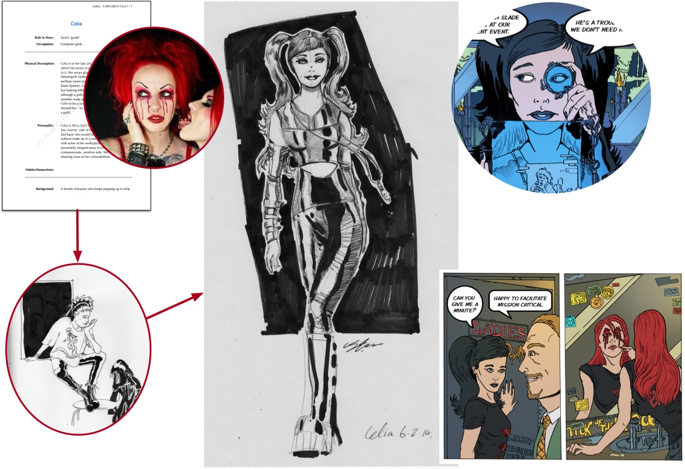{}

## Developing graphics

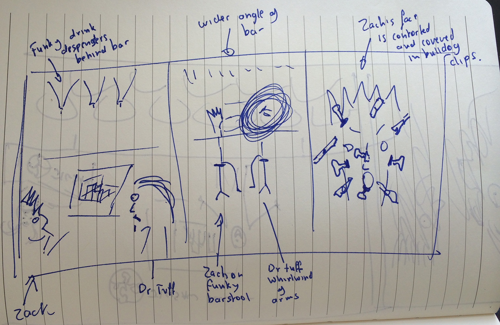{}

## Developing graphics

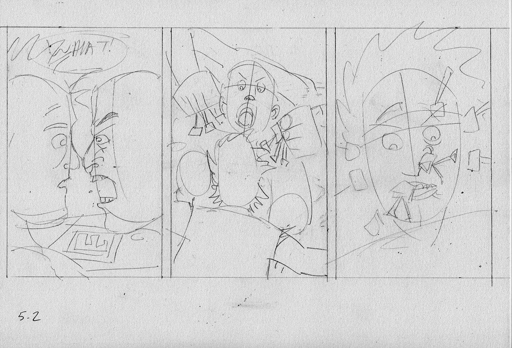{}

## Developing graphics

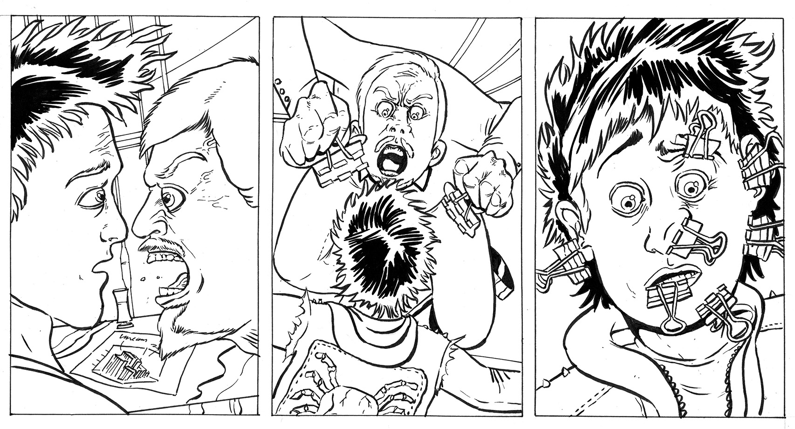{}

## Developing graphics

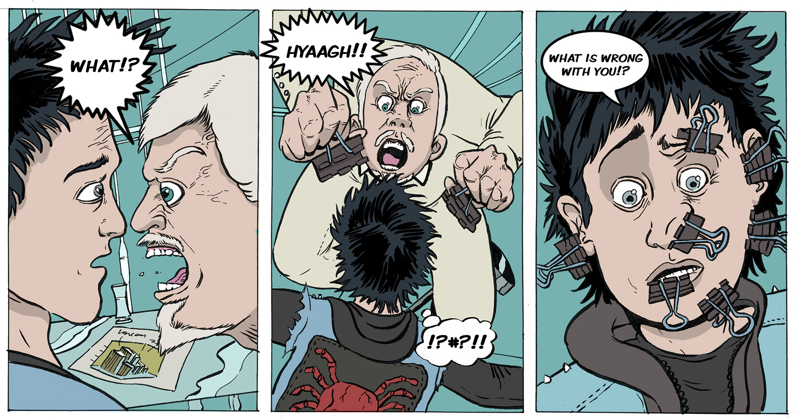{}

## Developing graphics


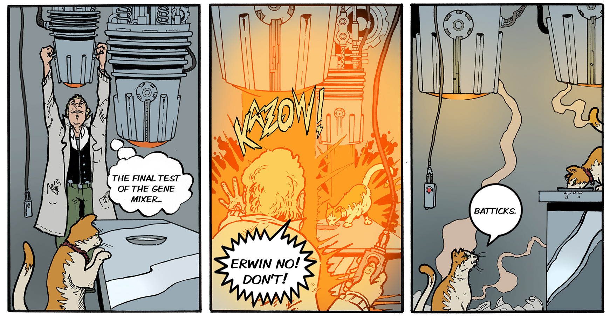{.absolute width=799.542px height=439.117px left=234.247px top=162.928px}

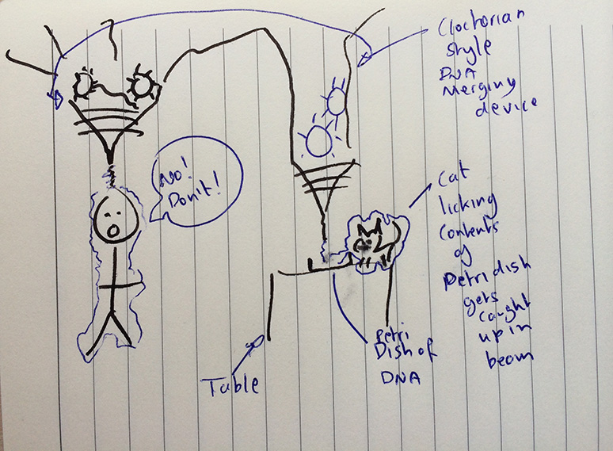{.absolute width=310.088px height=240.15px left=0px top=65px}

## Trivia

::: incremental

- Each Chapter subtitle is the name of a song
- I had a lot of fun naming stuff ...
  - [Elpis]{.alt} in Greek mythology is the personification of hope and learning should be approached with hope
  - Professor [Milton]{.alt} Grey was named after Schrödinger's actual cat
  - [The evil pockets]{.alt} is a translation of Malbowges from Dante's Inferno
  - The cafe made of programmable matter named after [Hermes]{.alt} the god of transformation.
  - Rival districts of [Jerzy]{.alt} and [Aylmer]{.alt} named after certain quarrelling Statisticians!
- ["Si Momentum Requiris, Circumspice"]{.alt} is a play on words of Christopher Wren's inscription at St. Paul's Cathedral (["Si Monumentum Requiris, Circumspect"]{.alt})
- There are lots of Easter eggs in the book ...

:::

## The road to hell is paved with ...

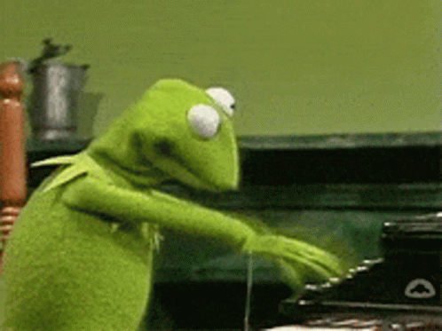{.absolute width=381.684px height=290.362px left=600px top=252px}

::: incremental

- 2 years prep
  - 87,204 words of storyline/character/object/location development
- 21 months writing (~4000 hours)
- Writing: 297,676 words, ~1.6 million characters, 13,421 paragraphs and 28,768 lines
  - 3-4 psychology PhD theses
  - 60 research papers
- Reading: at least 1.19 million of my own words
- 603 diagrams
- 185 data-related files
- 1 website

:::


::: notes

I don't know exactly how many hours I spent on the book, but I spent probably 2 years casually collecting ideas and thoughts, and developing ideas for the structure and so on. I spent another 21 months pretty much doing not a lot else but writing or re-drafting the book. I had my university job to do as well, so it's impossible to really know how many hours it took to create, but it's probably somewhere in the region of 4000 hours. That's just to the point of submitting the manuscript.
I wrote 297,676 words, ~1.6 million characters, 13,421 paragraphs and 28,768 lines. In terms of word length that's about 3-4 psychology PhD theses, or if you assume the average research paper is about 5000 words then it's about 60 research papers. In 2 years.
Given the book had three drafts, and I had to read proofs, I have read at least 1.19 million of my own words. It'll be a lot more than that because of stuff you write and then delete.
I used Scrivener to plan the story. My project document in which I gathered ideas (e.g., plot ideas, character outlines, descriptions of locations, venues, objects, concepts, artwork ideas etc.) contains another 87,204 words and quite a few images – in addition to the 297,676 word in the book itself.
I created 603 diagrams. [Not all of them are the book because this includes old versions of diagrams, and image files that I used in diagrams – for example, an image of a normal curve that I drop into a finished diagram
I created 185 data-related files (data files, R-scripts etc.)
I wrote ~4000 lines of R-code (to generate data, create graphs, run analyses etc.).

:::

## Was it all worth it?

::: {.column width="45%"}
::: fragment
> "If you're not doing something different, you're not doing anything at all."
> *Edward Tufte*

:::
:::

::: {.column width="10%"}
:::

::: {.column width="45%"}
::: fragment
> "I Have at least done something."
> *Andy Field*

:::
:::

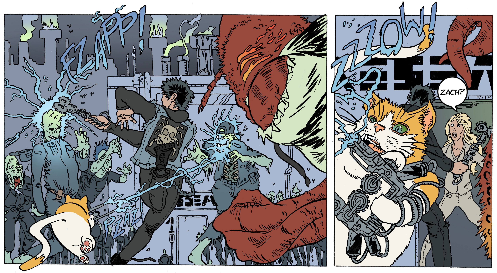{.absolute width=774px height=424px left=102px top=190px}

::: notes

Is being different good?

- To be clear, it's the most satisfying piece of work I have ever done. It is the thing I am most proud of.
- Has it created a paradigm shift? No.
- Do people love it. No - it's a Marmite book.
- It was shortlisted for 2 awards
- It's a quirky book overshadowed by the many other more traditional lecturer-friendly ones.
- I have never liked endings. When I was a child and people would come to stay, I always felt hollow when they left. For over 2 years, the characters in this book – especially Zach, Alice, Milton and Celia – were the house guests of my mind. We've had a lot of fun times. We've worked hard and played hard. We've had lots of late night conversations, we've shared our deepest feelings, we've discussed life, and they've helped me to see the world through different eyes. Now they have left me to find their own way in the world and I'm going to miss them. I feel a little hollow. "If you're not doing something different, you're not doing anything at all." then I feel that, with 'an adventure in statistics' I have at least done something.

:::


