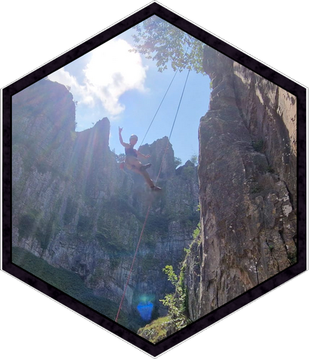
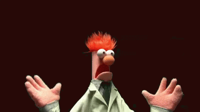
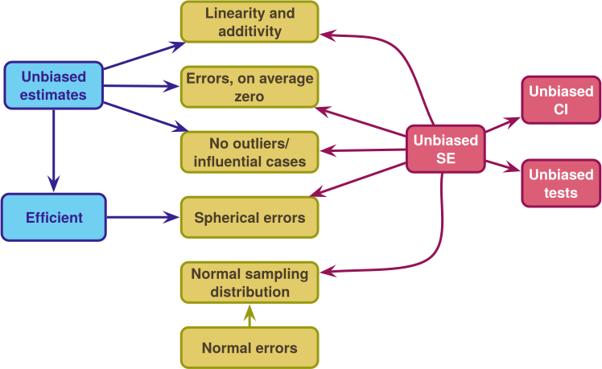
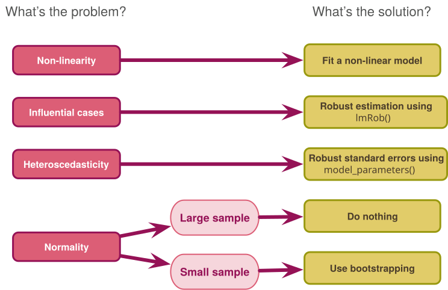
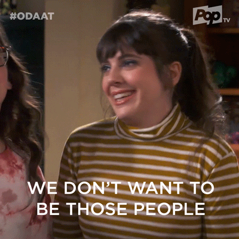

```{r}
#| output: false

library(patchwork)
library(tidyverse)
here::here("helpers/discovr_helpers.R") |> source()
source("martina_helpers.R")


backpack <- readRDS("../shared_data/backpack_020222.rds")
list2env(backpack, globalenv())

env <- readRDS("../shared_data/env_220322.rds")
env$demo <- readRDS("../shared_data/analysis_exercise_demo_merged.rds")
col <- readRDS("../shared_data/viridis.rds")

source("sladekova_field_2026_plots.R")
source("sladekova_poupa_field_2026_plots.R")
```

## Thanks

:::: columns
::: {.column width="50%"}
{height="250"}
:::

::: {.column width="50%"}

\

### Dr. Martina Sladekova

- [martinasladek.co.uk/](https://martinasladek.co.uk/)
- [github.com/martinasladek](https://github.com/martinasladek)

:::
::::


::::: fragment
:::: columns
::: {.column width="50%"}
::: center-h
{height="210"}
:::
:::

::: {.column width="50%"}
::: center-h
{height="210"}
:::
:::
::::
:::::

## OLS

- Influential cases

::: fragment

### Assumptions

- Linearity and additivity
- The population model should have [spherical errors]{.ong_bold}:
  - Homoscedastic errors
  - Independent errors
- Normality of something-or-other
  - Population model errors
  - Sampling distribution

:::

## OLS: consequences of bias

{fig-align="center" height=600}

## Robust procedures

- Robust parameter estimation
  - M-estimation to down-weight extreme cases
  - Trimming

::: fragment

- Robust standard error estimation
  - Heteroskedasticity-consistent standard errors (HC3, HC4)
  - Derive SEs empirically using bootstrap resampling
  - Generates Robust CIs and test-statistics

:::


## 

{fig-align="center" height=600}


## What do researchers know?

::: {.callout-note icon="false"}
## Sladekova & Field (in press)

-   Sladekova, M. & Field, A. P. (in press). Sources of bias in general linear models: assessing researchers understanding and self-reported practice. *Royal Society Open Science*. [osf.io/9xnsw](https://osf.io/9xnsw)

:::

::: fragment

### Participants

- 794 psychology researchers
  - 438 unique universities across 55 countries and 42 states.
  - 44.08% men, 42.19% women, 0.63% non-binary, and 0.13% genderqueer.
  - Mean age = 40.01 (SD = 10.79).
  - 46.73% faculty, 21.16% post-docs, 16.12% Ph.D., 3.53% non-academic
 
:::

## What do researchers know?

::: fragment

- Knowledge of OLS conditions
  - 50 statements (10 per 'assumption', 5 True, 5 False)
  - Rate from 0 (definitely false) to 10 (definitely true)
  
:::

::: fragment

- Analytic practice
  - 2 scenarios (1 experimental, 1 cross-sectional)
  - List of assumptions
  - For each one checked as relevant
    - 0 = *I do not check for violations of this assumption, nor do I apply any corrections*
    - 1 = *I check for violations of this assumption, but I do not apply any corrections when I find that the assumption is violated.*
    - 2 = *I do not check for violations of this assumption, but I apply corrections for potential violations anyway* OR *I check for violations of this assumption and I also apply corrections when I detect violations.*
  
:::

## What do researchers know?
### Linearity and additivity

```{r}
#| label: survey_lin
#| fig-width: 10
#| fig-height: 5
#| warning: false
#| message: false

p_lin_true + p_lin_false

```

## What do researchers know?
### Outliers

```{r}
#| label: survey_out
#| fig-width: 10
#| fig-height: 5
#| warning: false
#| message: false

p_out_true + p_out_false

```

## What do researchers know?
### Heteroscedasticity

```{r}
#| label: survey_het
#| fig-width: 10
#| fig-height: 5
#| warning: false
#| message: false

p_het_true + p_het_false

```

## What do researchers know?
### Independence

```{r}
#| label: survey_ind
#| fig-width: 10
#| fig-height: 5
#| warning: false
#| message: false

p_ind_true + p_ind_false

```

## What do researchers know?
### Normality

```{r}
#| label: survey_norm
#| fig-width: 10
#| fig-height: 5
#| warning: false
#| message: false

p_norm_true + p_norm_false

```


## What do researchers [say they]{.ong_bold} do?

```{r}
#| label: practice_scenario
#| fig-width: 10
#| fig-height: 5
#| warning: false
#| message: false

practice_plot_scenario
```

## What do researchers [say they]{.ong_bold} do?

```{r}
#| label: practice_overall
#| fig-width: 11
#| fig-height: 6
#| warning: false
#| message: false

practice_plot_knowledge
```

## What do researchers [actually]{.ong_bold} do?

::: {.callout-note icon="false"}
## Sladekova & Field (in press)

-   Sladekova, M., Poupa, V., & Field, A. P. (2026). Sources of bias in general linear models: Evaluating the analytic practice in psychological research. Royal Society Open Science, 13(2), 250076. doi: [10.1098/rsos.250076](https://doi.org/10.1098/rsos.250076)

:::

- 188 psychology researchers analysed data from two scenarios
  - Experimental
  - Cross-sectional
- Analytic scripts and descriptions subsequently coded for the level of attentiveness to
  - Outliers and influential cases
  - Heteroscedasticity
  - Non-normal model errors

## What do researchers [actually]{.ong_bold} do?

```{r}
#| label: analytic_practice
#| fig-width: 11
#| fig-height: 6
#| warning: false
#| message: false

analytic_practice_gg
```

## Conclusion

{height="500"}


