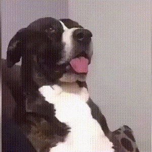
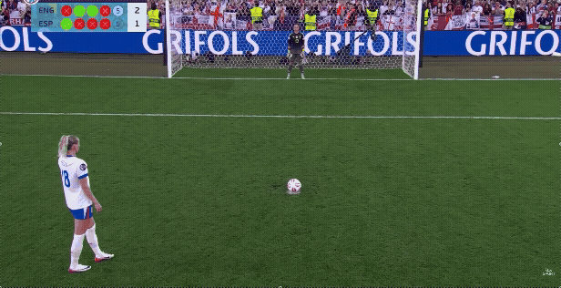
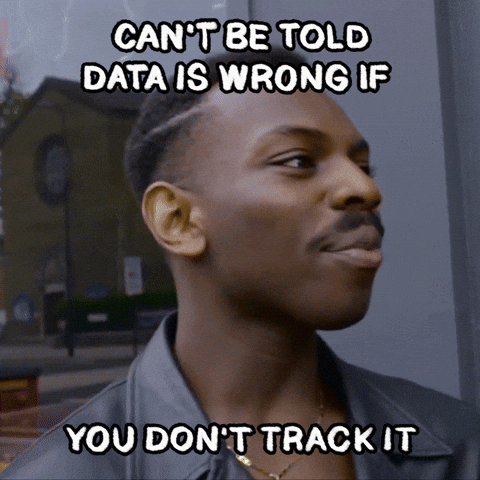
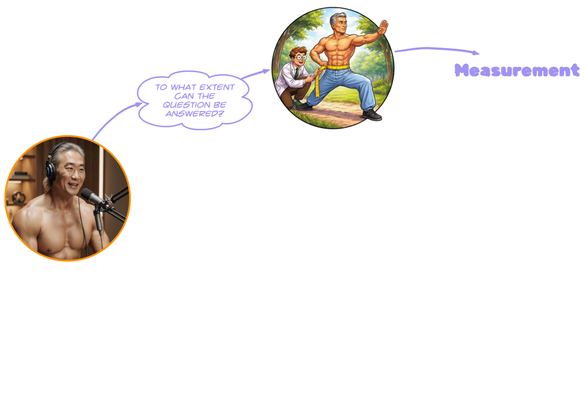
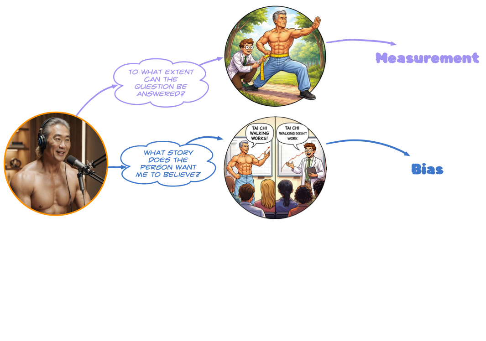
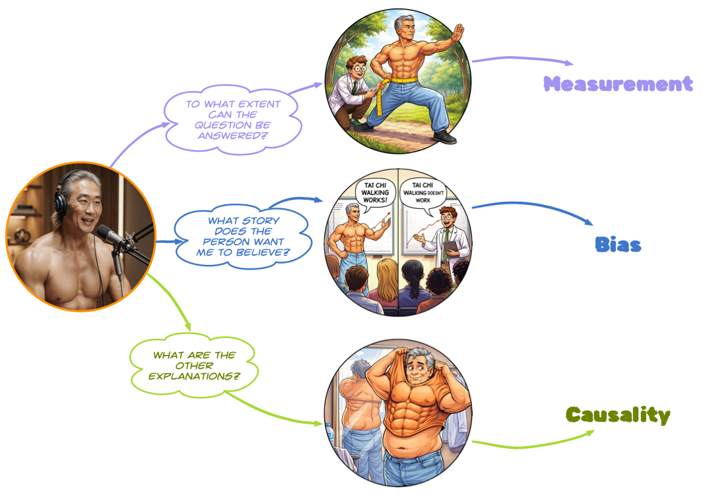

## Think of a belief

{.absolute top="100" left="400" height="500"}

## Where does that belief come from?

{.absolute top="100" left="400" height="500"}

## {background="../shared_media/images/information_overload.png"}

## {background="../shared_media/images/information_overload.png"}

{.absolute left=0 right=0 bottom=0 top=0 height="100%" width="100%" style="margin: auto auto;"}

## {background="../shared_media/images/information_overload.png"}

{.absolute left=0 right=0 bottom=0 top=0 height="100%" width="100%" style="margin: auto auto;"}

## {background="../shared_media/images/information_overload.png"}

{.absolute left=0 right=0 bottom=0 top=0 height="100%" width="100%" style="margin: auto auto;"}

## {background="../shared_media/images/information_overload.png"}

{.absolute left=0 right=0 bottom=0 top=0 height="100%" width="100%" style="margin: auto auto;"}

## {background="../shared_media/images/information_overload.png"}

## 

{.absolute top="0" left="550" height="650"}

## 

{.absolute top="0" left="0" height="650"}

## 

{.absolute top="0" left="0" height="650"}

## 

{.absolute top="0" left="0" height="650"}

## 

{.absolute top="0" left="0" height="650"}

