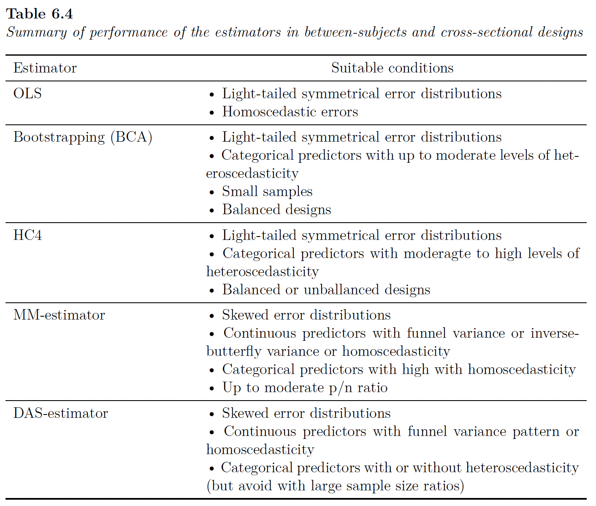
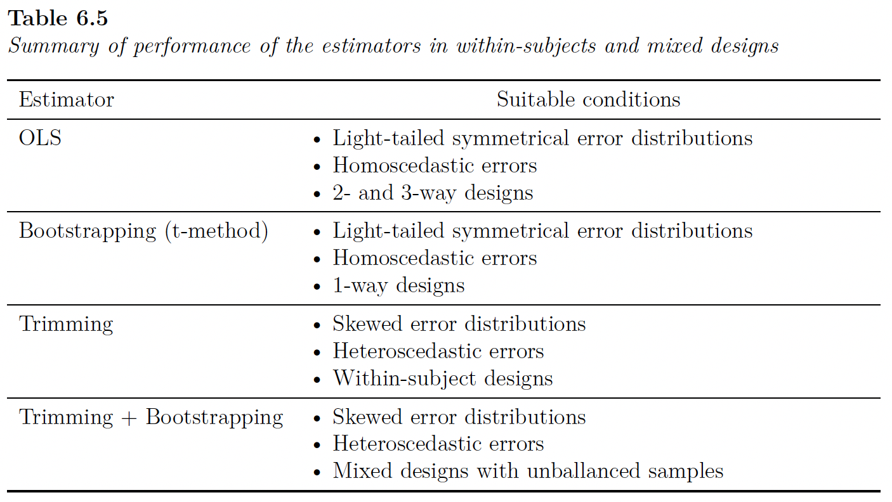
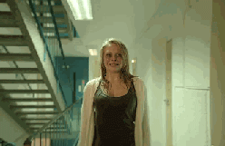

```{r}
#| output: false

library(patchwork)
library(tidyverse)
here::here("helpers/discovr_helpers.R") |> source()
source("martina_helpers.R")


backpack <- readRDS("../shared_data/backpack_020222.rds")
list2env(backpack, globalenv())

env <- readRDS("../shared_data/env_220322.rds")
env$demo <- readRDS("../shared_data/analysis_exercise_demo_merged.rds")
col <- readRDS("../shared_data/viridis.rds")

bp <- readRDS("../shared_data/unicorn_march2024.rds")

source("sladekova_field_unicorn_plots.R")
source("sladekova_field_2026_plots.R")
source("sladekova_poupa_field_2026_plots.R")
```

## Thanks

:::: columns
::: {.column width="50%"}
{height="250"}
:::

::: {.column width="50%"}

\

### Dr. Martina Sladekova

- [martinasladek.co.uk/](https://martinasladek.co.uk/)
- [github.com/martinasladek](https://github.com/martinasladek)

:::
::::


::::: fragment
:::: columns
::: {.column width="50%"}
::: center-h
{height="210"}
:::
:::

::: {.column width="50%"}
::: center-h
{height="210"}
:::
:::
::::
:::::

## The Number(s) of the Beast

:::: columns
::: {.column width="35%"}

:::

::: {.column width="10%"}
:::

::: {.column width="55%"}

\

> *Can this still be real, or just some crazy dream?*

:::
::::

<audio controls>
  <source src="../shared_media/audio/the_number_of_the_beast.mp3" type="audio/mpeg">
  <source src="../shared_media/audio/the_number_of_the_beast.ogg" type="audio/ogg"/>
</audio>


## Sources of Bias in OLS Estimation

::: {.callout-note icon="false"}
## Review

- Field A.P. (2026). [Discovering statistics using R & RStudio](https://www.discovr.rocks/). SAGE.
- Sladekova M, Field A.P. (2025). Robust statistical methods and the credibility movement of psychological science. *PeerJ*, 13:e20043. Doi: [10.7717/peerj.20043](https://doi.org/10.7717/peerj.20043)

:::


- Influential cases

::: fragment

### Assumptions

- Linearity and additivity
- The population model should have [spherical errors]{.ong_bold}:
  - Homoscedastic errors
  - Independent errors
- Normality of something-or-other
  - Population model errors
  - Sampling distribution

:::


## OLS: consequences of bias

{fig-align="center" height=600}

## Robust procedures

- Robust parameter estimation
  - M-estimation to down-weight extreme cases
    - Huber's $\psi$ weight function
    - The Design Adaptive Scale (DAS) estimator
  - Trimming

::: fragment

- Robust standard error estimation
  - Heteroskedasticity-consistent standard errors (HC3, HC4)
  - Derive SEs empirically using bootstrap resampling
- Generates Robust CIs and test-statistics

:::


## 

{fig-align="center" height=600}


## Psychology data

::: {.callout-note icon="false"}
## A review

- Sladekova, M., & Field, A. P. (2024). In Search of Unicorns: Assessing Statistical Assumptions in Real Psychology Datasets. *PsyArxiv*. DOI: [10.31234/osf.io/4rznt](https://doi.org/10.31234/osf.io/4rznt)

:::

- Past work suggests real data pose challenges to OLS assumptions (e.g., Micceri, 1989)
- We collected a sample of 588 OLS models from 119 published and unpublished papers
- Extracted and summarised distributional information from
the model [**residuals**]{.ong_bold}
  - Excess skew/kurtosis ($E(\mu) = 0$)
  - Number of modes
  - Proportion of $|z_\text{resid}|$ > 1.96 (5%), 2.58 (1%) and 3.29 (0.1%)
  - Heteroscedasticity using Quantile LOWESS Intervals (QLI).^[Sladekova & Field (in press). *Psychological Methods*. DOI: [10.1037/met0000821](https://doi.org/10.1037/met0000821).] Zero indicates homoscedasticity.


::: notes
A LOWESS model predicting the value of the residuals from predictor values
is fitted through the 2.5th and the 97.5th quantile of the residuals, constructing an interval around them. An OLS model is then fitted, predicting the width of the interval from the predictor values, including the linear, quadratic, cubic and quartic trends. In a
homoscedastic distribution, all trends are expected to be 0 whereas values above 0 indicate
non-constant variance.
:::

## Distributional properties

```{r}
#| label: uni_dist
#| fig-width: 10
#| fig-height: 5
#| warning: false
#| message: false

uni_dist_gg 

```

## Distributional properties

```{r}
uni_dist_tbl
```


## Heteroscedasticity

```{r}
#| label: uni_hetro
#| fig-width: 10
#| fig-height: 5
#| warning: false
#| message: false

uni_hetro_gg

```


## Heteroscedasticity

```{r}
uni_hetro_tbl
```

## Outliers

```{r}
#| label: uni_z
#| fig-width: 10
#| fig-height: 5
#| warning: false
#| message: false

uni_z_gg

```

## Outliers

```{r}
uni_z_tbl
```


::: notes
We found that OLS models typically violate their statistical assumptions, wherein error distributions are likely to be skewed, heavy-tailed and heteroscedastic. Although the extent of these violations was not extreme, these findings should be considered in conjunction with the small and often unbalanced sample sizes we found in our sample.
:::


## OLS and psychology data

::: {.callout-note icon="false"}
## A simulation

- Sladekova, M., & Field, A. P. (2024).  Commonly Used Statistical Models in Psychology are Not Equipped to Deal with Real-World Conditions: A Simulation. *PsyArxiv*. DOI: [10.31234/osf.io/xb4at](https://doi.org/10.31234/osf.io/xb4at)

:::

- Simulated > [**97,000**]{.ong_bold} combinations of conditions based on [Sladekova & Field (2024)](https://doi.org/10.31234/osf.io/4rznt)
- Looked at
  - False positive rate
  - Power
  - Estimation accuracy
  - Efficiency (dispersion)
- Compared estimators:
  - OLS
  - Bootstrap (BCA)
  - HC4
  - MM-Estimator
  - DAS-estimator


::: notes
The previous study looked at sample sizes and study design too
:::

## tl;dr between-subjects cross-sectional designs



## tl;dr repeated measures designs




## Revelations

:::: columns
::: {.column width="35%"}

:::

::: {.column width="10%"}
:::

::: {.column width="55%"}

\

> *"An easy way for the blind to go*
>
> *A clever path for the fools who know *


:::
::::

<audio controls>
  <source src="../shared_media/audio/revelations.mp3" type="audio/mpeg">
  <source src="../shared_media/audio/revelations.ogg" type="audio/ogg"/>
</audio>


## What do researchers know?

::: {.callout-note icon="false"}
## Sladekova & Field (in press)

-   Sladekova, M. & Field, A. P. (in press). Sources of bias in general linear models: assessing researchers understanding and self-reported practice. *Royal Society Open Science*. [osf.io/9xnsw](https://osf.io/9xnsw)

:::

::: fragment

### Participants

- 794 psychology researchers
  - 438 unique universities across 55 countries and 42 states.
  - 44.08% men, 42.19% women, 0.63% non-binary, and 0.13% genderqueer.
  - Mean age = 40.01 (SD = 10.79).
  - 46.73% faculty, 21.16% post-docs, 16.12% Ph.D., 3.53% non-academic
 
:::

## What do researchers know?

::: fragment

- Knowledge of OLS conditions
  - 50 statements (10 per 'assumption', 5 True, 5 False)
  - Rate from 0 (definitely false) to 10 (definitely true)
  
:::

::: fragment

- Analytic practice
  - 2 scenarios (1 experimental, 1 cross-sectional)
  - List of assumptions
  - For each one checked as relevant
    - 0 = *I do not check for violations of this assumption, nor do I apply any corrections*
    - 1 = *I check for violations of this assumption, but I do not apply any corrections when I find that the assumption is violated.*
    - 2 = *I do not check for violations of this assumption, but I apply corrections for potential violations anyway* OR *I check for violations of this assumption and I also apply corrections when I detect violations.*
  
:::

## What do researchers know?
### Linearity and additivity

```{r}
#| label: survey_lin
#| fig-width: 10
#| fig-height: 5
#| warning: false
#| message: false

p_lin_true + p_lin_false

```

## What do researchers know?
### Outliers

```{r}
#| label: survey_out
#| fig-width: 10
#| fig-height: 5
#| warning: false
#| message: false

p_out_true + p_out_false

```

## What do researchers know?
### Heteroscedasticity

```{r}
#| label: survey_het
#| fig-width: 10
#| fig-height: 5
#| warning: false
#| message: false

p_het_true + p_het_false

```

## What do researchers know?
### Independence

```{r}
#| label: survey_ind
#| fig-width: 10
#| fig-height: 5
#| warning: false
#| message: false

p_ind_true + p_ind_false

```

## What do researchers know?
### Normality

```{r}
#| label: survey_norm
#| fig-width: 10
#| fig-height: 5
#| warning: false
#| message: false

p_norm_true + p_norm_false

```


## What do researchers [say they]{.ong_bold} do?

```{r}
#| label: practice_scenario
#| fig-width: 10
#| fig-height: 5
#| warning: false
#| message: false

practice_plot_scenario
```

## What do researchers [say they]{.ong_bold} do?

```{r}
#| label: practice_overall
#| fig-width: 11
#| fig-height: 6
#| warning: false
#| message: false

practice_plot_knowledge
```

## What do researchers [actually]{.ong_bold} do?

::: {.callout-note icon="false"}
## Sladekova & Field (in press)

-   Sladekova, M., Poupa, V., & Field, A. P. (2026). Sources of bias in general linear models: Evaluating the analytic practice in psychological research. Royal Society Open Science, 13(2), 250076. doi: [10.1098/rsos.250076](https://doi.org/10.1098/rsos.250076)

:::

- 188 psychology researchers analysed data from two scenarios
  - Experimental
  - Cross-sectional
- Analytic scripts and descriptions subsequently coded for the level of attentiveness to
  - Outliers and influential cases
  - Heteroscedasticity
  - Non-normal model errors

## What do researchers [actually]{.ong_bold} do?

```{r}
#| label: analytic_practice
#| fig-width: 11
#| fig-height: 6
#| warning: false
#| message: false

analytic_practice_gg
```

## Caught Somewhere in Time

:::: columns
::: {.column width="35%"}

:::

::: {.column width="10%"}
:::

::: {.column width="55%"}

\

> *"Like a wolf in sheep's clothing,*
>
> *You try to hide your deepest sins,*
>
> *Of all the things that you've done wrong"*

:::
::::

<audio controls>
  <source src="../shared_media/audio/caught_somewhere_in_time.mp3" type="audio/mpeg">
  <source src="../shared_media/audio/caught_somewhere_in_time.ogg" type="audio/ogg"/>
</audio>

## Why?

- Statistics is hard
- Statistics takes time

\

{width="500"}

::: fragment

- Statistics is boring

:::

## {background-video="../shared_media/video/zach_r_book_boring.mp4" background-size="cover"}


::: notes
Even a 2 year old knows it's boring
:::

## Incentive structures

## ~~Incentive structures~~

## [Dis]{.ong_bold}incentive [(to get things correct)]{.ong_bold} structures^[Adapted from Edwards & Roy (2016)]

```{r}
#| label: incentives

tibble::tribble(
~`Incentive`, ~`Intended effect`, ~`Actual effect`, ~`and also ..`,
"Researchers rewarded for increased number of publications","Improve research productivity, provide a means of evaluating performance.","Avalanche of substandard, incremental papers; poor methods and increase in false discovery rates leading to a natural selection of bad science.", "Focus on significance over effect size.",
"Researchers rewarded for increased number of citations.", "Reward quality work that influences others.","Extended reference lists to inflate citations; reviewers request citation of their work through peer review.", "Focus on significance over effect size.",
"Researchers rewarded for 'high impact' publications","Reward quality work that influences others.","Focus on surprising results. Bias towards un-hypothesised but interesting findings.", "Focus on significance over effect size.",
"Researchers rewarded for increased grant funding","Ensure that research programs are funded, promote growth, generate overhead.","Increased time writing proposals and less time gathering and thinking about data. Overselling positive results and downplay of negative results.", "Focus on significance over effect size.",
) |> 
  knitr::kable(align = "lcccc") |> 
  kableExtra::kable_styling(font_size = 18, bootstrap_options = "striped") |> 
  kableExtra::column_spec(c(1, 3), background = turbo_10[2], color = "white", width = "15em") |> 
  kableExtra::column_spec(4, background = turbo_10[8], color = "white", width = "10em")
```

::: notes

Researchers are also incentivised to not be better .... which leads to a lot of this when they don't get significant results ....
:::

## {background-video="../shared_media/video/animal_screams.mp4" background-size="cover"}


::: notes
and a lot of this when they *do* get significant results
:::

## {background-video="../shared_media/video/dancing_cat.mp4" background-size="cover"}


## [Dis]{.ong_bold}incentive [(to get things correct)]{.ong_bold} structures^[Adapted from Edwards & Roy (2016)]

```{r}
#| label: incentives2

tibble::tribble(
~`Incentive`, ~`Intended effect`, ~`Actual effect`, ~`and also ..`,
"Researchers rewarded for increased number of publications","Improve research productivity, provide a means of evaluating performance.","Avalanche of substandard, incremental papers; poor methods and increase in false discovery rates leading to a natural selection of bad science.", "Focus on speed and results over process/robustness.",
"Researchers rewarded for increased number of citations.", "Reward quality work that influences others.","Extended reference lists to inflate citations; reviewers request citation of their work through peer review.", "Focus on results over process/robustness.",
"Researchers rewarded for 'high impact' publications","Reward quality work that influences others.","Focus on surprising results. Bias towards un-hypothesised but interesting findings.", "Focus on results over process/robustness.",
"Researchers rewarded for increased grant funding","Ensure that research programs are funded, promote growth, generate overhead.","Increased time writing proposals and less time gathering and thinking about data. Overselling positive results and downplay of negative results.", "Focus on results over process/robustness.",
) |> 
  knitr::kable(align = "lcccc") |> 
  kableExtra::kable_styling(font_size = 18, bootstrap_options = "striped") |> 
  kableExtra::column_spec(c(1, 3), background = turbo_10[2], color = "white", width = "15em") |> 
  kableExtra::column_spec(4, background = turbo_10[8], color = "white", width = "10em")
```


::: notes
and the consequences of this are ...

:::

##  Questionable Research Practices^[Fanelli (2009). PLoS One, 4. DOI: [10.1371/journal.pone.0005738](https://doi.org/10.1371/journal.pone.0005738)]


```{r}
#| label: fanelli

tibble::tribble(
~`Activity`, ~`Self (highest %)`, ~`Other (highest %)`,
"Fabricating data","4.5","60.0",
"Selective reporting","12.1","69.3",
"Dropping cases to benefit results","15.3","20.3",
"Terminating study at a time other than when planned","33.7","-",
"Fitting multiple models and reporting the most favourable", "-","45.8",
"Using inappropriate designs","13.5","39.2"
) |>
  knitr::kable(align = "lcccc", format = "html", escape = FALSE)  |>  
  kableExtra::kable_styling(font_size = 18, bootstrap_options = "striped") %>%
  kableExtra::column_spec(1, background = turbo_6[2], color = "white")
```

::: fragment
Less obvious QRPs:

- Focus on results over robustness/model fitting process
- 'Know not what they do' errors

:::


::: notes
Fanelli (2009) assimilated data from 18 published studies containing surveys about questionable research practices for scientists reporting on their own behaviour, and that of others.

Many of these practices violate the sytem I outlined earlier.

See Table S3 in the supplementary materials of the article (http://journals.plos.org/plosone/article?id=10.1371/journal.pone.0005738).

:::

## Consequences of the replication crisis

```{r}
#| label: open_science2

tibble::tribble(
~`Initiative`, ~`Explanation`, ~`Intended effect`,
"Registered reports", "Research accepted for publication before data collected", "Removes incentive to find significance. Analysis plans/methods reviewed ahead of time.",
"Pre-registration", "Research plans made public before data collected", "Increases accountability. Reduced QRPs. Greater transparency when  analysis plans changing.",
"Data/code sharing", "Data/code posted on public repository", "Errors more easily uncovered, secondary data analysis possible.",
"Statistical literacy", "Common statistical (mis)practice is being discussed/debated", "Fewer 'know not what they do' errors. Wider discussion of good practice.",
) |> 
  knitr::kable(align = "lcccc") |>  
  kableExtra::kable_styling(font_size = 18, bootstrap_options = "striped") |> 
  kableExtra::column_spec(c(1, 3), background = turbo_10[2], color = "white", width = "15em") |>  
  kableExtra::row_spec(4, background = turbo_10[8], color = "white")
```

::: notes
I put this slide in a talk I gave in 2019, it was a note of optimism about how things will get better, but as we have seen progress is slow.
:::

## Consequences of the replication crisis

```{r}
#| label: open_science3

tibble::tribble(
~`Initiative`, ~`Explanation`, ~`Intended effect`,
"Registered reports", "Research accepted for publication before data collected", "Encourages process/robustness over results.",
"Pre-registration", "Research plans made public before data collected", "Increases accountability. Reduced QRPs. Shifts focus to process/robustness over results.",
"Data/code sharing", "Data/code posted on public repository", "Errors more easily uncovered, secondary data analysis possible. Shifts focus to robustness/process.",
"Statistical literacy", "Common statistical (mis)practice is being discussed/debated", "Shifts focus to process/robustness.",
) |> 
  knitr::kable(align = "lcccc") |>  
  kableExtra::kable_styling(font_size = 18, bootstrap_options = "striped") |> 
  kableExtra::column_spec(c(1, 3), background = turbo_10[2], color = "white", width = "15em") |>  
  kableExtra::row_spec(4, background = turbo_10[8], color = "white")
```

## Brave New World

:::: columns
::: {.column width="35%"}

:::

::: {.column width="10%"}
:::

::: {.column width="55%"}

\

> *"Makes no sense of it all*
>
> *Close this mind, dull this brain *

:::
::::

<audio controls>
  <source src="../shared_media/audio/brave_new_world.mp3" type="audio/mpeg">
  <source src="../shared_media/audio/brave_new_world.ogg" type="audio/ogg"/>
</audio>


## 

{height="500"}

## Solutions

::: incremental

- Routine use of robust methods
  - Bring robustness into the conversation
- Less science?
  - Create time and space for better science
- Independent analysts?
  - Reproducibility checks
  - More team science
- Better education?
  - UVA leads the way!
  - Robust methods in software
  - More focus on the model fitting process in software/tools


:::
